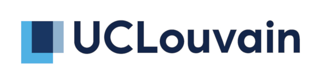
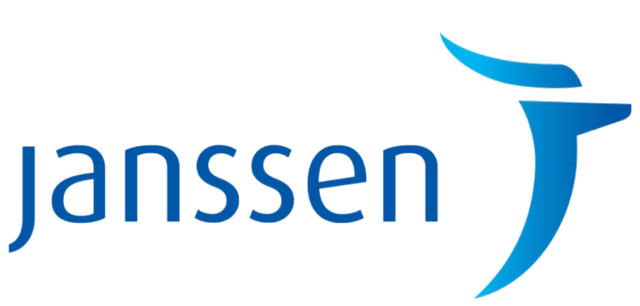



## Introduction

The European _Bioconductor_ meeting is aimed at biologists,
bioinformaticians, statisticians, programmers and software engineers
who use or contribute to the [Bioconductor
project](https://www.bioconductor.org/), or are interested in using
Bioconductor. The goals are to:

- foster the exchange of technical expertise
- keep contributors up to speed with the latest developments
- coordinate any related efforts

The main conference will be on FIXME
December 2020. An optional developer/user day is scheduled on FIXME.

## Programme

## Invited speakers

## Group discussion

The group discussions will be based on a invited talk, and will give
the participants the opportunity to continue the discussion under the
moderation of the speaker and other experts present at the
conference. We have around 4 topics (see below); participants will
choose which group discussion to contribute to at the beginning of the
second day.

The group discussion topics are:

- ...

## Flashlight sessions

Flashlights are intended to be short presentations covering a single
topic e.g. a new package or a particular technical problem you have
encountered. Each talk has been allotted **8 minutes** and presenters
should aim for approximately 6 slides. The following rules will apply
in these sessions in order to keep things flowing:

- ...

Speakers, please share you slides with your session chair in the
tea/lunch break preceding your session. Presentations will be
transferred to a single computer to ensure the smooth running of the
session. It's safest to use a PDF.

## User/developer sessions (free, optional)

We invite participants to form groups dedicated to discuss or work on
topics of interest on Wednesday. We have booked rooms for the
respective groups. The topics are set by one group leader, and are
advertised in advance of the event on the conference page.

To create a user/developer session, ...

## Sponsors

We would like to acknowledge the financial support of our sponsors for
making this event possible.

### Gold sponsor

<!--

-->

### Bronze sponsor

### Other

