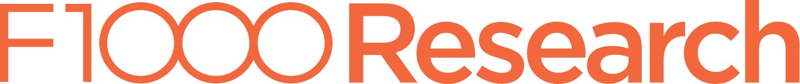
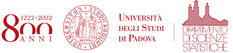
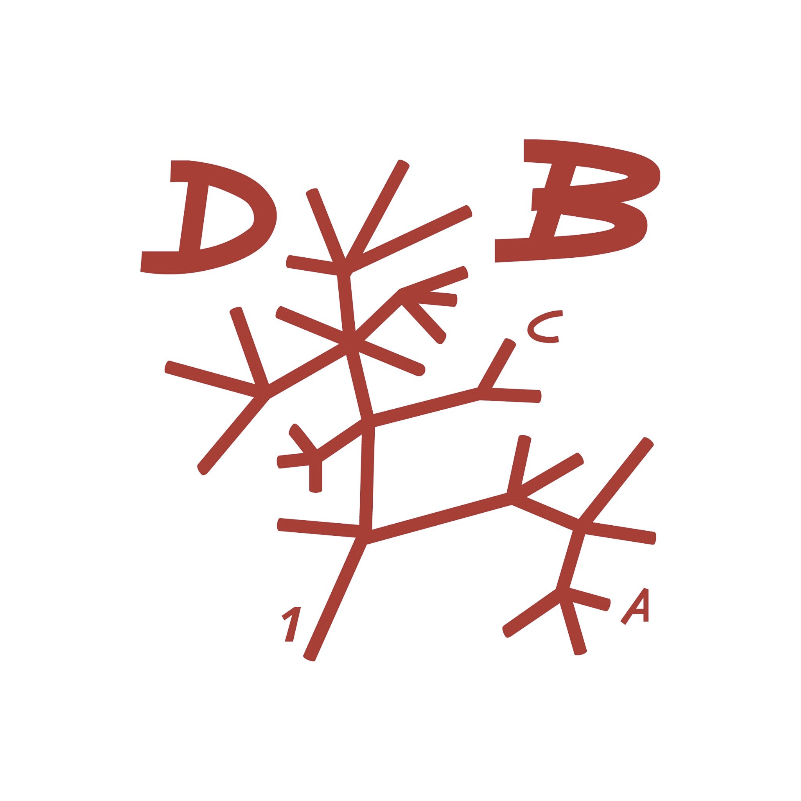



## The conference is live!

Join us at:
https://www.airmeet.com/e/0652b8c0-3a3e-11eb-babe-4130ba19b548

<!-- ## Registration open!

### Deadline: December 7, 2020

Please, register [here](https://www.eventbrite.com/e/eurobioc2020-tickets-127378088291)

## Abstract submission closed

The deadline for abstract submission has now passed; the conference is no longer accepting new submissions.

The organising committee is currently reviewing submissions, and notifications will be sent to authors shortly. -->

## General Information

The European _Bioconductor_ meeting is aimed at biologists,
bioinformaticians, statisticians, programmers and software engineers
who use or contribute to the [Bioconductor
project](https://www.bioconductor.org/), or are interested in using
Bioconductor. The goals are to:

- foster the exchange of technical expertise
- keep contributors up to speed with the latest developments
- coordinate any related efforts

The main conference will take place as a Virtual Conference on 14-18
December 2020.

## Invited speakers

[Confirmed invited speakers](speakers).

## Programme

[Conference schedule](conference_schedule).

## Sponsors

We would like to acknowledge the financial support of our sponsors for
making this event possible.

  

  

## Patronage

<!--

## Key Dates for virtual EuroBioc2020

- 1 Sep: Registration opens
- 15 Oct: Abstract submission opens
- 30 Oct: Abstract submission deadline
- 23 Nov: Notice of acceptance
- 30 Nov: Registration deadline
- 14-18 Dec: European Bioconductor Virtual Meeting

## Group discussions

The group discussions will be based on a invited talk, and will give
the participants the opportunity to continue the discussion under the
moderation of the speaker and other experts present at the
conference. We have around 4 topics (see below); participants will
choose which group discussion to contribute to at the beginning of the second day.

The group discussion topics will be announced soon.

## Flashlight sessions

Flashlights are intended to be short presentations covering a single
topic e.g. a new package or a particular technical problem you have
encountered. Each talk has been allotted **8 minutes** and presenters
should aim for approximately 6 slides. The following rules will apply
in these sessions in order to keep things flowing:

- ...

Speakers, please share you slides with your session chair in the
tea/lunch break preceding your session. Presentations will be
transferred to a single computer to ensure the smooth running of the
session. It's safest to use a PDF.

##  Conference Sponsors

-->
